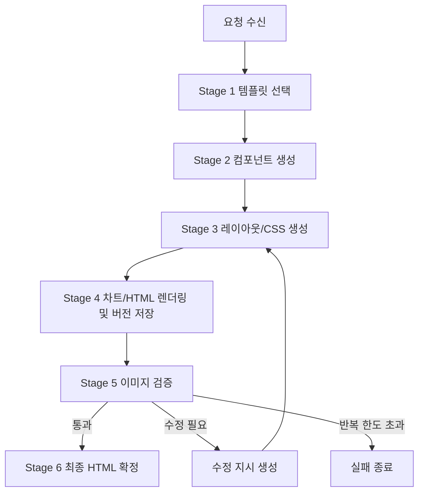

# 리포트 엔진 상세 설계서

> 기준 초안: `document/plan/리포트 생성 Idea-20260526134517.md`  
> 작성일: 2026-05-27  
> 대상 범위: PoC 리포트 HTML 생성 엔진의 Stage 1 ~ Stage 6 상세 설계  
> 산출물 위치: `document/plan/리포트_엔진_상세_설계서-20260527.md`

## 1. 개요

본 문서는 사용자가 선택한 ETF 데이터셋과 기준 템플릿을 입력으로 받아, LLM 기반 컴포넌트 생성, 레이아웃 생성, 렌더링, 검증 루프를 거쳐 최종 HTML 리포트를 생성하는 백엔드 엔진의 상세 설계를 정의한다.

이번 PoC는 구현 코드 작성이 아니라 구현 담당자가 바로 작업을 나눌 수 있는 설계 문서화를 목표로 한다. 따라서 각 프로세스별 입력, 출력, 구현 가능 여부, 난이도, 구현 방안, 리스크, 검증 방법을 명시한다.

## 2. 기준 데이터와 실행 전제

### 2.1 데이터 파일

| 구분 | 파일 | 스키마/역할 | CLI v1 구현 기준 |
| --- | --- | --- | --- |
| 데이터셋 bundle | `backend/data/etf_data.json` | `poc.etfMonthlyIssueReport.bundle.v1` | ETF 4개, 각 3개월 |
| 템플릿 catalog | `backend/data/report_templates.json` | `poc.etfReport.templates.v1` | 템플릿 2개 |
| Stage 2 입력 catalog | `backend/data/etf_stage2_component_sources.json` | `poc.etfReport.stage2ComponentSources.v1` | componentSources 60개 |
| Stage 2 출력 sample | `backend/data/etf_stage2_components.sample.json` | `poc.etfReport.stage2Components.v1` | stage2Components 60개 |
| 기준 템플릿 | `backend/data/report_template/우리은행_월간_리포트.html` | A4 portrait HTML | Stage 3 HTML 바인딩 기준 |
| 국민은행 템플릿 이미지 | `backend/data/report_template/국민은행_월간_리포트.png` | preview image | `tpl_kb_monthly_guidebook`의 Stage 3 멀티모달 시각 기준 |
| 우리은행 템플릿 이미지 | `backend/data/report_template/우리은행_월간_리포트.png` | preview image | `tpl_woori_monthly_report`의 Stage 3 멀티모달 시각 기준 |

데이터셋과 템플릿은 독립 선택 단위로 둔다. 요청자는 `datasetId`, `templateId`, `monthId`를 각각 지정하며, repository는 데이터셋의 판매사와 템플릿의 판매사가 일치하는지 검사하지 않는다.

### 2.2 Stage 2 컴포넌트 키

| componentKey | renderType | 역할 |
| --- | --- | --- |
| `performance_chart` | `chart` | ETF/BM 성과 차트 |
| `performance_summary` | `table` | 성과 요약표 |
| `top_holdings` | `table` | Top 10 보유내역 |
| `review` | `list` | ETF 리뷰 bullet |
| `outlook` | `article` | 향후 전망 본문 |

Stage 2 HTML은 구조 전용 fragment로 유지한다. `<style`, `style=`, `class=`를 넣지 않고 `styled=false`를 유지한다.

### 2.3 LLM 설정

Backend는 `backend/.env`의 LLM 설정을 사용한다. API key 값은 문서와 로그에 남기지 않는다.

| 환경변수 | 값/정책 | 설명 |
| --- | --- | --- |
| `LLM_MODEL` | `qwen/qwen3.6-27b` | Novita AI에서 사용할 기본 모델 |
| `LLM_BASE_URL` | `https://api.novita.ai/openai` | OpenAI-compatible endpoint |
| `LLM_API_KEY` | 값 비공개 | Novita API 인증 키 |
| `LLM_TEMPERATURE` | `0.0` | 문서/HTML 생성의 재현성 우선 |
| `LLM_MAX_TOKENS` | `65536` | 긴 HTML/검증 응답 허용 |
| `LLM_TIMEOUT_SECONDS` | `120` | LLM 호출 timeout |
| `LLM_CHUNK_SIZE_CHARS` | `12000` | 긴 입력 분할 기준 |
| `LLM_STAGE_BATCH_SIZE` | `12` | Stage 2 Novita 병렬 호출 상한. 현재 Stage 2는 선택 ETF/month당 5개 component source를 fan-out하므로 실제 동시 호출 수는 `min(5, LLM_STAGE_BATCH_SIZE)` |

## 3. 전체 처리 흐름



기본 반복 한도는 `maxIterations=3`으로 둔다. 반복 한도는 CLI/API 요청 옵션으로 조정 가능하게 설계한다.

## 4. Stage별 상세 설계

### 4.1 Stage 1: 템플릿 선택/이미지 확보

| 항목 | 내용 |
| --- | --- |
| 목적 | 리포트의 시각 기준이 되는 preview image를 확정한다. |
| 입력 | `templateId`, `previewImage`, page 설정 |
| 처리 | `report_templates.json`에서 선택한 `templateId`의 템플릿 메타를 조회한다. |
| 출력 | `TemplateContext` |
| 실패 처리 | 템플릿 이미지 파일이 없으면 `TEMPLATE_NOT_FOUND`로 job 실패 처리 |

`TemplateContext` 예시:

```json
{
  "templateId": "tpl_kb_monthly_guidebook",
  "previewImage": "backend/data/report_template/국민은행_월간_리포트.png",
  "page": {
    "size": "A4",
    "orientation": "portrait"
  }
}
```

### 4.2 Stage 2: 데이터 소스 선택 및 무스타일 컴포넌트 생성

| 항목 | 내용 |
| --- | --- |
| 목적 | 선택 ETF/month 조합의 5개 데이터 소스를 HTML fragment로 변환한다. |
| 입력 | `componentSources[]` 중 `datasetId + monthId`에 해당하는 5개 항목 |
| 처리 | `sample`은 catalog 조회, `novita`는 component source별 LLM 병렬 호출로 HTML fragment 생성 |
| 출력 | `Stage2Component[]` 5개 |
| 실패 처리 | 5개 componentKey 중 하나라도 누락되거나 LLM 응답 검수에 실패하면 `COMPONENT_SOURCE_INCOMPLETE` |

PoC 구현 기본값은 두 adapter를 모두 지원하는 구조로 둔다.

| adapter | 용도 | 동작 |
| --- | --- | --- |
| `sample` | 재현 가능한 로컬 검증 | `etf_stage2_components.sample.json`에서 5개 컴포넌트 조회 |
| `novita` | 실제 LLM 검증 | 선택된 5개 `etf_stage2_component_sources.json` payload를 componentKey 단위로 Novita LLM에 병렬 전달 |

`componentMode=novita`의 Stage 2 실행은 fan-out/fan-in 구조로 고정한다.

- fan-out: `performance_chart`, `performance_summary`, `top_holdings`, `review`, `outlook` 5개 source를 독립 LLM 요청으로 병렬 호출한다.
- 병렬 상한: 동시 호출 수는 `LLM_STAGE_BATCH_SIZE`를 넘지 않는다. 현재 1개 리포트의 Stage 2 source는 5개이므로 기본값 `12`에서는 5개가 동시에 호출된다.
- fan-in: LLM 응답 도착 순서와 무관하게 결과는 `performance_chart`, `performance_summary`, `top_holdings`, `review`, `outlook` 순서로 재정렬한 뒤 `Stage2Component[]`로 반환한다.
- 실패 처리: 5개 중 하나라도 timeout, invalid JSON, style/class 규칙 위반, component id 누락이 발생하면 Stage 2 전체를 실패 처리한다. partial component 결과를 Stage 3에 전달하지 않는다.

Stage 2 출력 검수 규칙:

- `componentId`는 `comp_{datasetId}_{monthId}_{componentKey}` 형식이다.
- `dataSourceId`는 입력 catalog의 값을 유지한다.
- `renderType`은 `chart`, `table`, `list`, `article` 중 하나이다.
- `performance_chart`만 `chartSpec` object를 가진다.
- 나머지 4개 컴포넌트의 `chartSpec`은 `null`이다.
- HTML에는 `<style`, `style=`, `class=`가 없어야 한다.

### 4.3 Stage 3: 레이아웃 및 스타일링

| 항목 | 내용 |
| --- | --- |
| 목적 | 템플릿 preview image와 Stage 2 fragment를 이용해 완성 HTML을 생성한다. |
| 입력 | `TemplateContext`, `Stage2Component[]`, 선택 dataset/month 메타 |
| 처리 | Novita LLM 멀티모달 호출로 A4 layout과 CSS를 생성한다. |
| 출력 | document-local CSS를 포함한 `ReportHtmlDraft` |
| 실패 처리 | HTML skeleton 누락, component 누락, CSS 누락, chart placeholder 누락, Stage 3 chart 렌더링 시도 시 `LAYOUT_GENERATION_INVALID` |

Stage 3 LLM prompt는 아래 제약을 반드시 포함한다.

- 결과는 단일 HTML 문서로 반환한다.
- A4 portrait 크기를 유지한다.
- 본문 섹션 순서는 `performanceTrend`, `topHoldings`, `review`, `outlook`을 따른다.
- 템플릿 preview의 header/footer/brand 구조를 유지한다.
- Stage 2 fragment의 수치와 문구를 변경하지 않는다.
- CSS는 Stage 3에서만 생성하고, 외부 파일 없이 document-local `<style>` block 또는 동등한 내부 CSS로 포함한다.
- 외부 네트워크 리소스를 참조하지 않는다.
- 차트는 Stage 3에서 렌더링하지 않는다.
- `performance_chart`는 `data-chart-placeholder` 컨테이너만 유지한다.
- SVG, canvas, script, Chart.js 등 실제 차트 렌더링 markup은 생성하지 않는다.
- footer와 하단 고지 문구는 normal document flow에 둔다.
- footer 또는 하단 고지 문구에 `position:absolute` 또는 `position:fixed`를 사용하지 않는다.
- 마지막 본문 섹션이 footer와 겹치지 않도록 bottom safe area를 확보한다.
- 본문이 길면 footer 위로 겹치지 말고 세로 간격/글자 크기 조정 또는 정상 flow 확장으로 처리한다.

차트는 Stage 4에서 백엔드 SVG/이미지 렌더링으로 생성한다. Stage 2의 `chartSpec`은 차트 생성 입력 계약으로 유지하되 Stage 3 prompt에는 직접 전달하지 않는다. Stage 3 HTML에는 생성된 inline SVG나 이미지 참조를 삽입하지 않고, Stage 4가 교체할 `data-chart-placeholder`만 둔다.

### 4.4 Stage 4: 차트/HTML 렌더링 및 버전 저장

| 항목 | 내용 |
| --- | --- |
| 목적 | 차트 placeholder를 실제 차트로 교체한 HTML을 preview image로 렌더링하고 버전 단위로 저장한다. |
| 입력 | `ReportHtmlDraft`, `performance_chart.chartSpec`, `jobId`, `version number` |
| 처리 | `chartSpec` 기반 SVG/이미지 생성, `data-chart-placeholder` 교체, HTML 저장, PNG preview 생성, version metadata 저장 |
| 출력 | `ReportVersion` |
| 실패 처리 | chartSpec 누락, chart placeholder 누락/교체 실패, HTML 렌더링 실패, preview 누락 시 `RENDER_FAILED` |

Stage 4 처리 순서는 아래로 고정한다.

1. Stage 2의 `performance_chart.chartSpec`을 읽는다.
2. `ChartRenderer`가 chartSpec을 백엔드 SVG 또는 image asset으로 렌더링한다.
3. Stage 3 HTML의 `data-chart-placeholder` 컨테이너를 생성된 chart markup 또는 image reference로 교체한다.
4. 교체된 HTML을 `runs/{jobId}/v{version}/report.html`에 저장한다.
5. `HTML Renderer`가 저장된 HTML을 열어 `preview.png`를 생성한다.
6. `VersionStore`가 `ReportVersion(status="verifying")` metadata를 저장한다.

Stage 4에서 생성하는 chart는 운영 전환 전까지 백엔드 SVG/이미지를 기본값으로 둔다. Chart.js 같은 브라우저 실행 코드, 외부 script, 외부 네트워크 리소스는 PoC 기본 경로에 포함하지 않는다.

`ReportVersion` 예시:

```json
{
  "jobId": "job_20260527_001",
  "version": 1,
  "htmlPath": "runs/job_20260527_001/v1/report.html",
  "previewImagePath": "runs/job_20260527_001/v1/preview.png",
  "status": "verifying",
  "createdAt": "2026-05-27T00:00:00+09:00"
}
```

렌더링 구현 후보:

| 방식 | PoC 적합성 | 비고 |
| --- | --- | --- |
| Playwright/Chromium screenshot | 높음 | 브라우저 렌더링과 실제 HTML 품질 확인에 유리 |
| WeasyPrint PDF/PNG | 중간 | `requirements.txt`에 존재하나 HTML/CSS 호환성 확인 필요 |
| PyMuPDF 기반 PDF 이미지화 | 중간 | PDF 변환 단계가 필요 |

PoC 기본값은 Playwright/Chromium screenshot으로 설계한다. 환경에 따라 WeasyPrint는 fallback으로 둔다.

### 4.5 Stage 5: 이미지 검증 및 수정 루프

| 항목 | 내용 |
| --- | --- |
| 목적 | preview image를 LLM에 전달해 레이아웃 품질을 검증하고 수정 지시를 생성한다. |
| 입력 | `ReportVersion.previewImagePath`, 현재 HTML |
| 처리 | Novita LLM 멀티모달 검증, issue 생성, 수정 지시 반영 |
| 출력 | `VerificationResult` 또는 다음 HTML draft |
| 실패 처리 | 반복 한도 초과 시 `VERIFICATION_MAX_ITERATIONS_EXCEEDED` |

검증 issue type:

| type | 의미 | 예시 |
| --- | --- | --- |
| `overlap` | 요소 간 겹침 | 제목과 표가 겹침 |
| `overflow` | 요소가 영역 밖으로 벗어남 | 표가 페이지 오른쪽 밖으로 밀림 |
| `clipping` | 요소 일부가 잘림 | footer 문구 하단 잘림 |
| `missing_content` | 입력 컴포넌트가 누락됨 | outlook 섹션 누락 |
| `data_mismatch` | 원천 수치/문구가 변경됨 | Top 10 합계 변경 |

Stage 5에서 수정이 필요하다고 판단되면 수정 지시는 Stage 3 재생성 입력으로 전달되고, 재생성된 HTML은 다시 Stage 4 차트/HTML 렌더링 및 버전 저장으로 진입한다. 수정 1회마다 새 version을 생성해 preview를 다시 검증한다.

`VerificationResult` 예시:

```json
{
  "passed": false,
  "issues": [
    {
      "type": "overflow",
      "region": "top_holdings",
      "detail": "Top 10 table right edge exceeds page content width.",
      "severity": "major"
    }
  ],
  "revisionInstruction": "Reduce table font size and column padding in top_holdings section."
}
```

### 4.6 Stage 6: 최종 HTML 확정

| 항목 | 내용 |
| --- | --- |
| 목적 | 검증을 통과한 version을 최종 산출물로 확정한다. |
| 입력 | `ReportVersion` 중 `verification.passed=true` |
| 처리 | final alias 생성, status 업데이트 |
| 출력 | 최종 HTML 경로와 preview image 경로 |
| 실패 처리 | 통과 version이 없으면 `NO_PASSED_VERSION` |

최종 산출물은 HTML이다. PDF/A4 pagination 검증은 PoC 제외 범위이며 운영 전환 Open Issue로 남긴다.

## 5. 프로세스별 구현 가능성 표

| 프로세스 | 구현 가능 여부 | 난이도(상/중/하) | 근거 | 구현 방안 | 필요 입력 | 산출물 | 주요 리스크 | 검증 방법 |
| --- | --- | --- | --- | --- | --- | --- | --- | --- |
| Stage 1 템플릿 선택/이미지 확보 | 가능 | 중 | 템플릿 catalog에 source HTML과 preview image 경로가 존재 | `report_templates.json`에서 `templateId` 조회 후 파일 존재 확인 | `templateId` | `TemplateContext` | 경로 누락, 이미지 해상도 부족 | 파일 존재, 확장자, A4 page 설정 확인 |
| Stage 2 컴포넌트 생성 | 가능 | 중 | componentSources/sample components가 60개로 준비됨 | sample adapter 우선, Novita adapter는 componentKey별 prompt를 병렬 fan-out 호출 후 key 순서로 fan-in 정렬 | `datasetId`, `monthId`, `componentSources[]`, `LLM_*` 설정 | `Stage2Component[]` 5개 | LLM이 style/class 삽입, 수치 변경, 일부 병렬 호출 실패 | HTML 금지 문자열 검사, componentKey 5개 확인, partial failure test |
| Stage 3 레이아웃/CSS 생성 | 조건부 가능 | 상 | 멀티모달 레이아웃 품질이 LLM 응답 안정성에 의존 | 템플릿 preview image와 5개 컴포넌트를 Novita에 전달해 document-local CSS 포함 단일 HTML 생성. chart는 placeholder만 유지 | `TemplateContext`, `Stage2Component[]` | CSS 포함 `ReportHtmlDraft` | A4 overflow, 원천 데이터 변형, CSS 누락/과도 생성, Stage 3 chart 렌더링 시도 | CSS 포함 검사, 렌더링 후 이미지 검증, 원천 수치 비교, chart rendering markup 금지 검사 |
| Stage 4 차트/HTML 렌더링 및 버전 저장 | 가능 | 중 | chartSpec은 Stage 2에서 구조화되어 있고 HTML preview 렌더링은 표준 브라우저 자동화로 구현 가능 | ChartRenderer로 `performance_chart.chartSpec`을 SVG/이미지로 만들고 placeholder를 교체한 뒤 Playwright screenshot과 version directory 저장 | HTML draft, `performance_chart.chartSpec`, jobId, version number | chart 포함 `ReportVersion` | chartSpec 불완전, placeholder 교체 실패, 브라우저 폰트 차이, 렌더링 실패 | chart placeholder 교체 검사, preview 파일 생성, viewport/A4 크기 확인 |
| Stage 5 이미지 검증/수정 루프 | 조건부 가능 | 상 | 이미지 검증은 LLM 판단 품질과 수정 지시 품질에 의존 | preview image를 Novita에 전달해 issue JSON을 받고 Stage 3 재생성 | preview image, current HTML, maxIterations | `VerificationResult`, revised HTML | false pass, 반복 수렴 실패 | issue schema 검사, 반복 한도, 수동 spot check |
| Stage 6 최종 HTML 확정 | 가능 | 중 | 통과 version을 alias 처리하는 단순 상태 전이 | `passed` version을 final로 표시하고 경로 반환 | passed `ReportVersion` | final HTML/preview | 통과 version 없음 | status와 final path 존재 확인 |
| API/CLI 실행 | 가능 | 중 | backend는 Python 의존성 기반으로 CLI/API 모두 설계 가능 | 공통 engine service를 CLI와 HTTP handler에서 호출 | request payload, env 설정 | jobId, final result | CLI/API 옵션 불일치 | 동일 입력으로 CLI/API 결과 비교 |
| 진행 이벤트 전송 | 가능 | 중 | 버전/검증 진행 상태가 명확한 이벤트 단위로 나뉨 | HTTP는 SSE, CLI는 line-delimited JSON event 출력 | stage 상태, version metadata | progress events | 이벤트 유실, 순서 역전 | event sequence test |
| 장애 처리 | 가능 | 중 | 각 Stage별 실패 코드 정의 가능 | typed error code와 recoverable 여부를 version/job 상태에 기록 | exception, stage context | failed job metadata | LLM timeout, partial output | timeout/retry test, 실패 상태 조회 |

## 6. 데이터 모델

### 6.1 ReportJobRequest

```json
{
  "datasetId": "data_kodex_us_sp500",
  "templateId": "tpl_kb_monthly_guidebook",
  "monthId": "2026-03",
  "componentMode": "sample",
  "layoutMode": "novita",
  "verificationMode": "novita",
  "maxIterations": 3
}
```

| 필드 | 설명 |
| --- | --- |
| `datasetId` | `etf_data.json`의 데이터셋 식별자 |
| `templateId` | `report_templates.json`의 템플릿 식별자 |
| `monthId` | `YYYY-MM` 형식 월 식별자 |
| `componentMode` | `sample` 또는 `novita` |
| `layoutMode` | `novita` |
| `verificationMode` | `novita` 또는 `manual-pass` |
| `maxIterations` | Stage 5 최대 반복 횟수 |

현재 CLI 입력에서 사용하는 식별자 허용 값은 아래와 같다.

| 필드 | 허용 값 |
| --- | --- |
| `datasetId` | `data_kodex_us_sp500_h`, `data_kodex_us_sp500`, `data_kodex_us_nasdaq100`, `data_kodex_korea_dividend_growth_bond_mixed` |
| `templateId` | `tpl_kb_monthly_guidebook`, `tpl_woori_monthly_report` |
| `monthId` | `2026-01`, `2026-02`, `2026-03` |

### 6.2 ReportJobState

```json
{
  "jobId": "job_20260527_001",
  "status": "running",
  "currentStage": "stage4_render",
  "datasetId": "data_kodex_us_sp500",
  "templateId": "tpl_kb_monthly_guidebook",
  "monthId": "2026-03",
  "latestVersion": 1,
  "finalVersion": null
}
```

상태값은 `queued`, `running`, `passed`, `failed`, `cancelled`로 제한한다.

### 6.3 ProgressEvent

```json
{
  "event": "version.created",
  "jobId": "job_20260527_001",
  "stage": "stage4_render",
  "version": 1,
  "payload": {
    "previewImagePath": "runs/job_20260527_001/v1/preview.png"
  }
}
```

이벤트 종류:

- `job.started`
- `stage.started`
- `component.generated`
- `version.created`
- `verification.completed`
- `job.completed`
- `job.failed`

## 7. CLI/API 입출력 설계

### 7.1 CLI

```bash
python -m report_engine run \
  --dataset-id data_kodex_us_sp500 \
  --template-id tpl_kb_monthly_guidebook \
  --month-id 2026-03 \
  --component-mode sample \
  --layout-mode novita \
  --verification-mode novita \
  --max-iterations 3 \
  --output-dir runs
```

CLI는 progress event를 line-delimited JSON으로 stdout에 출력한다. 최종 성공 시 final HTML path와 preview path를 반환한다.

### 7.2 HTTP API

| Method | Path | 목적 |
| --- | --- | --- |
| `POST` | `/api/report-jobs` | 리포트 생성 job 시작 |
| `GET` | `/api/report-jobs/{jobId}` | job 상태 조회 |
| `GET` | `/api/report-jobs/{jobId}/events` | SSE progress stream |
| `GET` | `/api/report-jobs/{jobId}/versions` | version 목록 조회 |
| `GET` | `/api/report-jobs/{jobId}/versions/{version}` | version 상세 조회 |
| `GET` | `/api/report-jobs/{jobId}/final-html` | 최종 HTML 조회 |

SSE는 HTTP 단방향 event stream으로 설계한다. 클라이언트가 중간 버전 preview를 즉시 표시할 수 있어야 한다.

## 8. 오류 처리와 재시도

| 코드 | 발생 Stage | 처리 |
| --- | --- | --- |
| `TEMPLATE_NOT_FOUND` | Stage 1 | job 실패 |
| `COMPONENT_SOURCE_INCOMPLETE` | Stage 2 | job 실패 |
| `LLM_TIMEOUT` | Stage 2/3/5 | 1회 재시도 후 실패 |
| `LLM_INVALID_JSON` | Stage 5 | JSON repair prompt 1회 후 실패 |
| `LAYOUT_GENERATION_INVALID` | Stage 3 | correction prompt 1회 후 실패 |
| `RENDER_FAILED` | Stage 4 | chart renderer 또는 HTML renderer fallback 시도 후 실패 |
| `VERIFICATION_MAX_ITERATIONS_EXCEEDED` | Stage 5 | latest version을 failed로 기록 |
| `NO_PASSED_VERSION` | Stage 6 | job 실패 |

재시도는 동일 Stage 안에서만 수행한다. Stage 5의 수정 루프는 재시도가 아니라 새 version 생성으로 계산한다.

## 9. 테스트 기준

| 테스트 | 기대 결과 |
| --- | --- |
| JSON 유효성 | `etf_data.json`, `etf_stage2_component_sources.json`, `etf_stage2_components.sample.json` 파싱 성공 |
| 데이터 카운트 | dataset 4개, componentSources 60개, stage2Components 60개 |
| Stage 2 금지 항목 | `<style`, `style=`, `class=` 없음 |
| Stage 3 HTML 생성 | 단일 HTML 문서, document-local CSS, 5개 섹션 포함 |
| Stage 4 렌더링 | chart placeholder가 실제 chart로 교체된 version별 `report.html`, `preview.png` 생성 |
| Stage 5 검증 | issue JSON schema 준수, passed 또는 revised 결정 |
| 비밀값 검수 | `LLM_API_KEY` 실제 값이 로그/문서/결과에 없음 |

## 10. Open Issues

| 항목 | 현재 결정 | 운영 전환 시 검토 |
| --- | --- | --- |
| A4 페이지네이션 | PoC 제외 | 다중 페이지 분할과 인쇄 검증 추가 |
| HTML 실행 격리 | PoC 내부 렌더링 | sandbox iframe, CSP, sanitization |
| LLM 품질 안정화 | 반복 검증 루프 | prompt versioning, golden sample 비교 |
| 차트 렌더링 | 백엔드 SVG/이미지 기본 | Chart.js, server-side SVG, static PNG 성능 비교 |
| 저장소 | 로컬 `runs/` 기준 | object storage, DB metadata, retention policy |

## 11. 문서 자체 검수 체크리스트

- Stage 1 ~ Stage 6의 입력/출력과 실패 처리가 모두 포함되어야 한다.
- 프로세스별 구현 가능성 표에 구현 가능 여부, 난이도, 근거, 구현 방안, 필요 입력, 산출물, 리스크, 검증 방법이 모두 있어야 한다.
- Novita AI endpoint와 `qwen/qwen3.6-27b` 모델 전제가 포함되어야 한다.
- `LLM_API_KEY` 실제 값은 포함하지 않아야 한다.
- 외부 Mermaid 이미지 링크가 없어야 한다.
