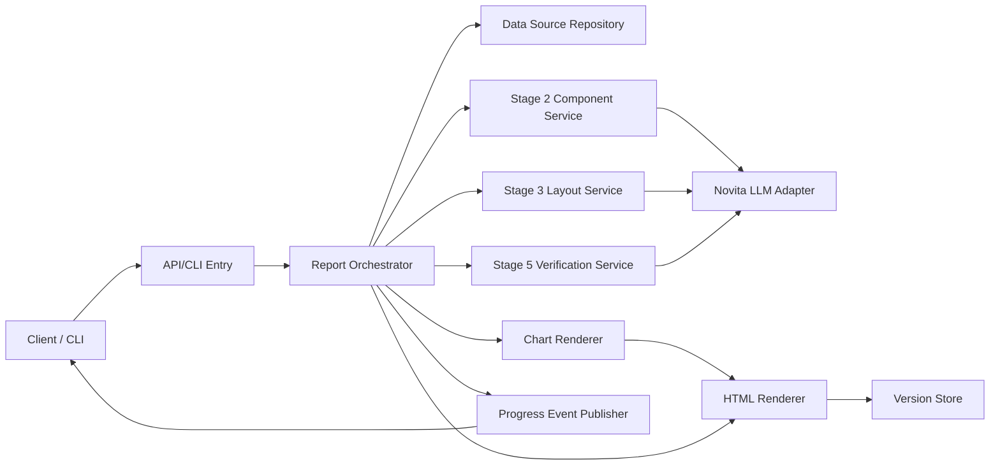
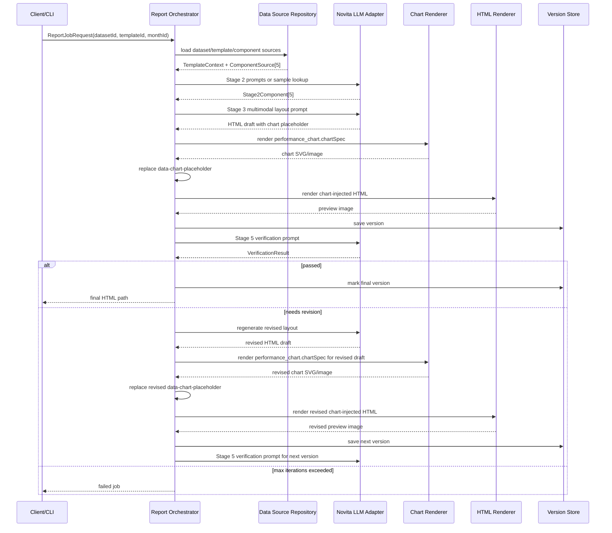
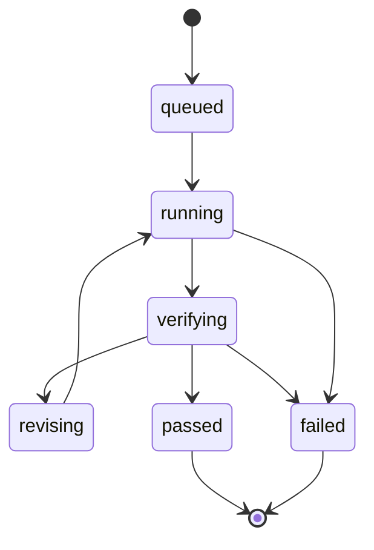
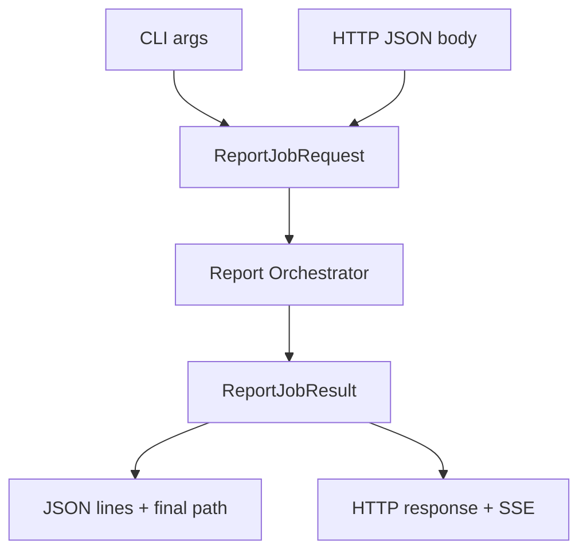

# 리포트 엔진 아키텍처 문서

> 기준 초안: `document/plan/리포트 생성 Idea-20260526134517.md`  
> 작성일: 2026-05-27  
> 대상 범위: PoC 리포트 생성 엔진의 논리 아키텍처와 주요 컴포넌트 책임  
> 산출물 위치: `document/plan/리포트_엔진_아키텍처_문서-20260527.md`

## 1. 아키텍처 목표

리포트 엔진은 ETF 월별 데이터와 기준 템플릿을 받아 최종 HTML 리포트를 생성하는 백엔드 중심 파이프라인이다. 핵심 목표는 다음과 같다.

- Stage별 책임을 분리해 LLM 생성, 렌더링, 검증, 저장을 독립적으로 교체할 수 있게 한다.
- Novita AI OpenAI-compatible API를 LLM 호출 경계로 두고, 모델은 `qwen/qwen3.6-27b`를 기본값으로 사용한다.
- Stage 2의 구조 생성과 Stage 3의 표현 생성은 분리한다.
- 렌더링된 preview image를 기반으로 Stage 5 검증 루프를 수행한다.
- 클라이언트는 API 또는 CLI를 통해 동일한 엔진 코어를 실행할 수 있다.

## 2. 논리 아키텍처



## 3. 주요 컴포넌트 책임

| 컴포넌트 | 책임 | 입력 | 출력 |
| --- | --- | --- | --- |
| API/CLI Entry | 요청 파라미터 검증, job 생성, progress 노출 | HTTP request 또는 CLI args | `ReportJobRequest` |
| Report Orchestrator | Stage 1 ~ 6 순서 제어, 재시도, 실패 상태 관리 | `ReportJobRequest` | job state, final result |
| Data Source Repository | `etf_data.json`, `report_templates.json`, Stage 2 catalog/sample 조회 | `datasetId`, `templateId`, `monthId` | dataset, template, componentSources, sample components |
| Stage 2 Component Service | 5개 무스타일 컴포넌트 생성 | componentSources, LLM config | `Stage2Component[]` |
| Chart Renderer | `chartSpec`을 SVG/이미지로 변환하고 Stage 3 chart placeholder 교체에 필요한 payload를 만든다. | `chartSpec`, `data-chart-placeholder`, theme | inline SVG 또는 image path |
| Stage 3 Layout Service | 템플릿 이미지와 컴포넌트를 layout/CSS 포함 통합 HTML로 조립하고 chart 영역은 placeholder로 유지한다. | preview image, components | chart placeholder 포함 HTML draft + CSS |
| HTML Renderer | chart가 삽입된 HTML을 preview image로 렌더링 | chart-injected HTML draft | `preview.png` |
| Version Store | chart가 삽입된 HTML, preview, 검증 결과를 version 단위로 저장 | version payload | `ReportVersion` |
| Stage 5 Verification Service | preview image 검증과 수정 지시 생성 | preview image, HTML | `VerificationResult` |
| Novita LLM Adapter | Novita AI API 호출, timeout/retry, 응답 정규화 | prompt, image, config | text/json response |
| Progress Event Publisher | job/stage/version/verification 이벤트 발행 | job state changes | SSE 또는 CLI JSON lines |

Stage 3의 시각 기준 이미지는 선택한 `templateId`의 `report_templates.json` 항목을 사용한다. `tpl_kb_monthly_guidebook`은 `backend/data/report_template/국민은행_월간_리포트.png`, `tpl_woori_monthly_report`는 `backend/data/report_template/우리은행_월간_리포트.png`를 참조한다. 템플릿 catalog는 preview image와 page 설정만 보유하며 HTML 템플릿 파일은 참조하지 않는다. 데이터셋과 템플릿은 독립 선택 단위이므로 repository는 판매사 일치 여부를 검사하지 않는다.

## 4. LLM 호출 아키텍처

Backend는 `backend/.env`의 아래 설정을 읽는다. `LLM_API_KEY` 값은 로그와 문서에 출력하지 않는다.

| 설정 | 값/정책 |
| --- | --- |
| Provider | Novita AI |
| API 형식 | OpenAI-compatible |
| `LLM_BASE_URL` | `https://api.novita.ai/openai` |
| `LLM_MODEL` | `qwen/qwen3.6-27b` |
| `LLM_TEMPERATURE` | `0.0` |
| `LLM_MAX_TOKENS` | `65536` |
| `LLM_TIMEOUT_SECONDS` | `120` |
| `LLM_CHUNK_SIZE_CHARS` | `12000` |
| `LLM_STAGE_BATCH_SIZE` | `12` |

LLM 호출 지점:

| Stage | 호출 방식 | 모달리티 | 출력 |
| --- | --- | --- | --- |
| Stage 2 | component source별 병렬 또는 batch | text | 무스타일 HTML fragment |
| Stage 3 | 단일 호출 | image + text | 통합 HTML + CSS |
| Stage 5 | 반복 호출 | image + text | 검증 JSON 또는 수정 지시 |

Stage 2는 sample adapter로도 실행 가능해야 한다. 이는 LLM 품질과 무관하게 렌더링/검증 경로를 재현하기 위한 PoC 안전장치다.

## 5. 데이터 흐름



### 5.1 Stage 2 컴포넌트 흐름

Stage 2는 선택된 `datasetId + monthId` 조합에 대해 항상 5개 컴포넌트를 생성한다. 아키텍처상 `Stage 2 Component Service`는 아래 componentKey를 안정적인 단위로 다루며, 이 순서와 개수는 Stage 3 입력 계약의 전제다.

| componentKey | renderType | 아키텍처 역할 |
| --- | --- | --- |
| `performance_chart` | `chart` | Stage 4에서 `chartSpec`을 `Chart Renderer`에 전달해 백엔드 SVG/이미지를 만들고 Stage 3 placeholder를 교체한다. |
| `performance_summary` | `table` | 성과 요약표 HTML fragment를 제공한다. |
| `top_holdings` | `table` | Top 10 보유내역 HTML fragment를 제공한다. |
| `review` | `list` | ETF 리뷰 bullet HTML fragment를 제공한다. |
| `outlook` | `article` | 향후 전망 article HTML fragment를 제공한다. |

### 5.2 Stage 5 검증 issue 흐름

`Stage 5 Verification Service`는 preview image와 현재 HTML을 함께 검증하고, 발견된 문제를 표준 issue type으로 정규화한다.

| issue type | 의미 | 후속 처리 |
| --- | --- | --- |
| `overlap` | 요소 간 겹침 | 해당 region의 margin, grid, font size 수정 지시 |
| `overflow` | 페이지 또는 섹션 경계 밖으로 벗어남 | width, column, wrapping, scale 조정 |
| `clipping` | 텍스트/표/푸터 일부가 잘림 | height, padding, font size, page safe area 조정 |
| `missing_content` | 원천 컴포넌트 일부 누락 | Stage 3 재생성 요청 |
| `data_mismatch` | 원천 수치 또는 문구 변경 | 원천 데이터 보존 조건을 포함해 재생성 요청 |

## 6. 저장소 구조

PoC 실행 산출물은 로컬 `runs/` 하위에 저장하는 구조로 설계한다.

```text
runs/
  job_20260527_001/
    job.json
    events.jsonl
    v1/
      report.html
      preview.png
      verification.json
    v2/
      report.html
      preview.png
      verification.json
    final/
      report.html
      preview.png
```

| 파일 | 역할 |
| --- | --- |
| `job.json` | 요청 파라미터, 현재 상태, final version |
| `events.jsonl` | 진행 이벤트 append log |
| `v*/report.html` | version별 HTML |
| `v*/preview.png` | version별 preview image |
| `v*/verification.json` | version별 검증 결과 |
| `final/*` | 통과 version alias |

## 7. 이벤트 아키텍처

HTTP API는 SSE를 기본 진행 이벤트 채널로 사용한다. CLI는 같은 이벤트 payload를 line-delimited JSON으로 출력한다.



| 이벤트 | 발생 시점 | 주요 payload |
| --- | --- | --- |
| `job.started` | job 실행 시작 | `jobId`, request summary |
| `stage.started` | Stage 진입 | `stage`, `iteration` |
| `component.generated` | Stage 2 component 생성 | `componentId`, `componentKey` |
| `version.created` | Stage 4 저장 완료 | `version`, `htmlPath`, `previewImagePath` |
| `verification.completed` | Stage 5 검증 완료 | `passed`, `issues[]` |
| `job.completed` | Stage 6 완료 | `finalVersion`, `htmlPath` |
| `job.failed` | 실패 종료 | `errorCode`, `stage`, `detail` |

## 8. 프로세스별 구현 가능성 요약

| 프로세스 | 구현 가능 여부 | 난이도(상/중/하) | 근거 | 구현 방안 | 필요 입력 | 산출물 | 주요 리스크 | 검증 방법 |
| --- | --- | --- | --- | --- | --- | --- | --- | --- |
| Stage 1 템플릿 선택/이미지 확보 | 가능 | 중 | 템플릿 catalog에 source HTML과 preview image 경로가 있음 | repository 계층에서 `templateId`로 경로 조회와 파일 존재 확인 | `templateId`, template catalog | `TemplateContext` | 잘못된 상대 경로 | 파일 존재 검사, page 설정 검사 |
| Stage 2 컴포넌트 생성 | 가능 | 중 | Stage 2 catalog와 sample output이 이미 60개 존재 | sample adapter와 Novita adapter를 동일 interface로 구현 | component source 5개, LLM 설정 | component 5개 | LLM 출력이 무스타일 규칙 위반 | 금지 문자열 검사, schema 검사 |
| Stage 3 레이아웃/CSS 생성 | 조건부 가능 | 상 | 템플릿 이미지 기반 품질 판단이 LLM에 의존 | 멀티모달 prompt로 document-local CSS 포함 단일 HTML 생성, chart는 `data-chart-placeholder`만 유지하고 footer는 normal flow에 둔다 | template image, components | HTML draft + CSS | CSS 누락, overflow, clipping, 데이터 변경, Stage 3 chart 렌더링 시도, footer collision | CSS 포함 검사, render preview, 데이터 대조, chart rendering markup 금지 검사, footer absolute/fixed 금지 검사 |
| Stage 4 차트/HTML 렌더링 및 버전 저장 | 가능 | 중 | chartSpec은 Stage 2에서 구조화되어 있고 HTML preview 렌더링은 브라우저 자동화로 구현 가능 | ChartRenderer가 `performance_chart.chartSpec`을 SVG/이미지로 만들고 `data-chart-placeholder`를 교체한 뒤 Playwright screenshot 후 version directory 저장 | HTML draft, chartSpec, job metadata | chart 포함 `ReportVersion` | chartSpec 불완전, placeholder 교체 실패, 폰트/브라우저 차이 | chart placeholder 교체 확인, preview 생성 확인, A4 pixel 비율 확인 |
| Stage 5 이미지 검증/수정 루프 | 조건부 가능 | 상 | LLM 시각 검증 품질과 반복 수렴성이 변수 | preview image를 Novita에 전달해 issue JSON 생성 후 재생성 | preview image, HTML, iteration | `VerificationResult` | false positive/pass, 무한 수정 | max iteration, issue schema, 수동 샘플 검수 |
| Stage 6 최종 HTML 확정 | 가능 | 중 | 검증 통과 version alias 생성은 단순 상태 처리 | `passed` version을 final로 복사/참조 | passed version | final HTML/preview | 통과 version 없음 | final path와 status 확인 |
| API/CLI 실행 | 가능 | 중 | 엔진 코어를 entrypoint와 분리하면 양쪽 모두 가능 | 공통 service 호출, request schema 공유 | CLI args 또는 HTTP body | job response | 옵션 불일치 | CLI/API 동일 입력 회귀 테스트 |
| 진행 이벤트 전송 | 가능 | 중 | Stage 경계와 version 생성 시점이 명확함 | SSE stream과 JSONL event writer 병행 | job state changes | event stream/log | 이벤트 순서 불일치 | sequence assertion |
| 장애 처리 | 가능 | 중 | Stage별 실패 코드 정의 가능 | typed error code, retry policy, failed state 저장 | exception context | failed job state | timeout, partial response | timeout test, malformed LLM response test |

## 9. API/CLI 경계

API와 CLI는 서로 다른 실행면이지만 동일한 `Report Orchestrator`를 호출한다.



이 구조를 사용하면 PoC 자동화는 CLI로 빠르게 검증하고, 프론트엔드 통합은 HTTP API/SSE로 확장할 수 있다.

## 10. 장애 처리 아키텍처

| 장애 유형 | 감지 위치 | 복구 전략 |
| --- | --- | --- |
| 환경변수 누락 | startup 또는 job 시작 | `CONFIG_INVALID`로 즉시 실패 |
| LLM timeout | Novita LLM Adapter | 1회 재시도 후 `LLM_TIMEOUT` |
| LLM JSON 파싱 실패 | Verification Service | repair prompt 1회 후 실패 |
| 무스타일 규칙 위반 | Stage 2 Component Service | correction prompt 또는 sample fallback |
| 차트 렌더링 실패 | Chart Renderer | `RENDER_FAILED`로 실패하고 version 생성을 중단 |
| HTML 렌더링 실패 | HTML Renderer | fallback renderer 시도 후 실패 |
| 검증 루프 미수렴 | Orchestrator | max iteration 도달 후 실패 |

장애는 모두 `job.json`과 `events.jsonl`에 기록한다. API 응답에는 비밀값, 전체 prompt, 원본 API key를 포함하지 않는다.

## 11. 운영 전환 고려사항

| 항목 | PoC 결정 | 운영 검토 |
| --- | --- | --- |
| LLM provider | Novita AI, `qwen/qwen3.6-27b` | provider fallback, model version pinning |
| HTML 격리 | 내부 렌더링 기준 | sandbox iframe, CSP, HTML sanitizer |
| 저장소 | 로컬 `runs/` | DB metadata, object storage, retention |
| 차트 | 백엔드 SVG/이미지 기본 | 서버 렌더링 성능, 캐싱, 스타일 일관성 |
| A4 페이지네이션 | 제외 | 다중 페이지 레이아웃, PDF export, 인쇄 검증 |
| 검증 품질 | LLM visual check | rule-based layout 검사와 병행 |

## 12. 문서 자체 검수 체크리스트

- 외부 Mermaid 이미지 링크가 없어야 한다.
- 논리 아키텍처, 시퀀스, 상태 흐름이 텍스트 Mermaid로 표현되어야 한다.
- Novita AI endpoint와 `qwen/qwen3.6-27b` 모델 전제가 있어야 한다.
- 프로세스별 구현 가능성 표가 모든 주요 프로세스를 포함해야 한다.
- `LLM_API_KEY` 실제 값이 포함되지 않아야 한다.
